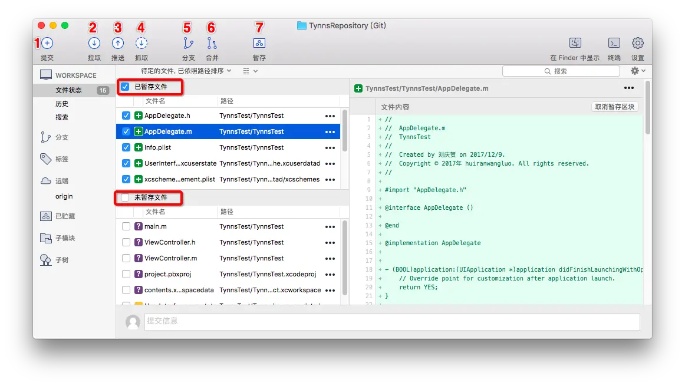

# Sourcetree
[Sourcetree在mac平台下的安装与使用超详尽教程](https://www.jianshu.com/p/b8d0547a8449)

## Ⅰ

- 1.提交:**Commit** 指本地仓库的文件提交到本地仓库保存
- 2.拉取:**Pull** 从关联账号的托管平台(比如github)的众多远程仓库中下载一个仓库到本地,前提是你得账号里创建的有仓库
- 3.推送:**Push** 将本地仓库源文件提交到本地并更新到托管平台的远程仓库中,即本地和原唱仓库都保存此时仓库中的所有内容(如果不配置ignore忽略文件的话)
- 4.抓取:**Fetch** 从远程仓库抓取本仓库的更新内容(比如这个项目是团队开发,别人也可能Push代码到这个仓库,这时候你可能就需要更新一下)并更新到本地仓库
- 5.分支: **branch** 分支本质上其实就是一个指向某次提交的可变指针HEAD,指向当前默认分支master或者上一分支.我们之所以需要创建分支分两种情况:
  - 一种是当团队开发时,为了各自干自己的活不相互影响,这时候每个哥们儿都可以从主分支上建立一个属于自己的分支出来,并在自己的分支开发,当开发完毕时,再合并到主分支即可
  - 另一种情况是个人开发,你需要集成某个功能但你又不确定自己是否可以集成成功且不影响源码,这时可以建立新分支,然后再开发,如果集成失败了,又把分支源码搞的乱七八糟,你还可以直接回滚到主分支,重新再来
- 6.合并:**merge** 这个当然是在有分支的前提下进行了,只有创建了分支,在分支上开发完毕后,就可以把当前分支合并到主分支或上一分支了
- 7.暂存:**git stash** 好像是吧.你可以理解为暂时保存已修改内容, 原仓库代码恢复到最新的一次提交,具体怎么用可以举个例子: 假如我们正在自己的分支上修改某个功能, 修改到一半了, 另一个iOS小伙伴让你把主干分支代码合并到自己的分支, 这时候你没办法拉去代码, 没办法合并, 因为你有修改但未提交的文件, 这时候就有两个方案, 第一个方案可以暂时把自己改的东西提交一下, 再拉取合并, 第二个方案使用贮存, 将目前已经修改的代码贮存到一个标签当中, 等拉取合并完之后, 再把贮存的代码还原到自己的分支.
所以贮存起到了暂时保存你当前修改的内容的作用,防止丢失, 让开发者方便做其他操作

## II

- 打开Sourcetree本地仓库查看,我们发现刚才的改动的文件显示到了为暂存文件区域,选中AppDelegate.m文件,预览代码直接显示在右边的区域类,用绿色文字和+显示(如果是删除了这一行,会用红色文字和-)出修改内容,是不是一目了然

## III

- 点击左上角的提交按钮,输入提交日志(强烈建议写上,用于以后区分每次提交的代码所修改的内容),勾选立即推送的话可以直接提交到远程仓库,最后提交右下角的提交,即可保存到本地仓库和远程仓库

## IV

- 如果弹出这个框,就输入一下所关联github账号密码即可

## V

- **回滚操作**当我们提交代码到仓库后,如果想回滚到上次提交的状态时,选中左边的"历史"-->选中你要回滚的提交区块,点击右边的"回滚区块按钮",点击后,什么也不用做,直接用Xcode打开本地仓库文件中的项目查看,那行代码就消失了,即回滚成功
