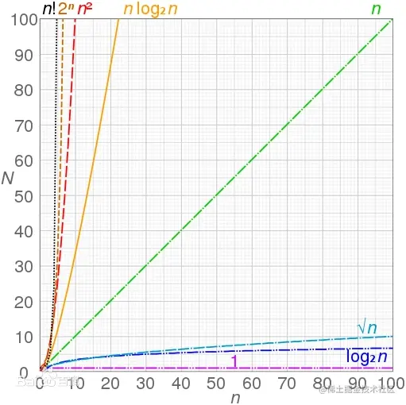

# 算法

## 如何学习算法

> 1. 先掌握对应的数据结构
>    > 以面试中最常见的二叉树为例
>    > 先了解如何创建一个二叉树，通过创建的过程，加深对该数据结构的理解，非常有助于了去解答对应的题目
> 2. 分类练习
>    > 分类练习，即按照每种数据结构进行统一练习
>    > 例如：这段时间只练习二叉树的题目，通过集中的训练，对二叉树有整体的认知。了解前、中、后序遍历的特点、了解二叉搜索树、了解各种题型等体系知识
>    > 同时做好对应的笔记，不建议一上来就直接用 leetcode 刷题

## 算法基础知识

**时间复杂度**

> 表示代码执行的次数，时间与算法中语句执行次数成正比例，哪个算法中执行语句次数多，它花费的时间就越长，时间复杂度是取代码中最复杂的代码来计算
> 时间复杂度按时间的大小，从小到大排序依次是
> `O(1)<O(logn)<O(n)<O(nlogn)<O(n²)<O(n³)<O(2ⁿ)<O(n!)`

常见的时间复杂度有：

> - O(1): Constant Complexity: Constant 常数复杂度
> - O(log n): Logarithmic Complexity: 对数复杂度
> - O(n): Linear Complexity: 线性时间复杂度
> - O(n^2): N square Complexity 平⽅方
> - O(n^3): N square Complexity ⽴立⽅方
> - O(2^n): Exponential Growth 指数
> - O(n!): Factorial 阶乘



**空间复杂度**

> 在算法运算过程中用到的额外的存储空间（不包含原始值的内存大小），反映的对内存占用的趋势，而不是具体内存

**最经典的场景**
`利用空间去换时间，降低时间复杂度，减少计算时间`

## 前端 数据结构

**数组、栈、队列、树、堆、链表、哈希表、图**

#### 数组

数组是最简单、也是最常用的数据结构
数组是可以在内存中连续存储多个元素的结构，在内存中的分配也是连续的
**特点：查询快，增删慢**
1）查询快：数组的地址是连续的，我们通过数组的首地址可以找到数组，通过数组的索引可以快速查找某一个元素
2）增删慢：数组的长度是固定的，我们想要增加/删除一个元素，必须创建一个新的数组，把原数组的数据复制过来

##### 最长递增子序列

> 该算法在 vue3 diff 算法中有用到，作用是找到最长递归子序列后，可以减少子元素的移动次数

一个整数数组 nums，找到其中一组最长递增子序列的值
`最长递增子序列`是指：子序列中的所有元素单调递增
例如：`[3,5,7,1,2,8]` 的 `LIS` 是 `[3,5,7,8]`

```js
// 该算法用的是动态规划的思想，时间复杂度为n²，并不是最优算法，最优算法应该是二分查找，最优时间复杂度为nlogn

function lengthOfLIS(nums) {
  if (!nums.length) return 0;
  // 创建一个和原数组等长的数组dp，用来存储每一项的最长递增子序列，比如[1,2,2] 表示第二项和第三项的最长递增子序列都为2
  // 该数组每一项初始值都为1，记录当前项的最长递增子序列，后面的项会在当前项的最长递增子序列个数进行累加
  let dp = new Array(nums.length).fill(1);
  // 双层for循环，每一项都和之前的所有项一一进行比较，计算出该项的最长递增子序列个数，存储到dp中
  for (let i = 0; i < nums.length; i++) {
    // 当前项依次和之前的每一项进行比较，累加出当前项的最长递增子序列
    for (let j = 0; j < i; j++) {
      if (nums[j] < nums[i]) {
        // 比较当前项已有的最大值和之前项最大值，比如当比较到第三项[1,2,2]时，如第三项比第二项大，所以第三项的计算结果为[1,2,3]
        dp[i] = Math.max(dp[i], dp[j] + 1);
      }
    }
  }
  // 取出一组最长递增子序列的具体值（注意：最长递增子序列有可能有多组值，这里是只取出其中一组值）
  // 找到dp中的最大值，该值就是nums的最长递增子序列的个数
  let max = Math.max(...dp);
  let result = [];
  for (let i = max; i >= 1; i--) {
    // 倒序遍历，根据长度获取对应的值
    findArrNode(dp, i, result, nums);
  }
  return result;
}
function findArrNode(dp, value, result, arr) {
  // 找到符合条件最后一项的下标，这样才能保证数组的顺序是正确的
  let index = dp.lastIndexOf(value);
  // 存储对应的值
  result.unshift(arr[index]);
  // 对dp进行截取，保证只取最大项之前的数据
  dp.length = index + 1;
}

// 测试
console.log(lengthOfLIS([9, 1, 7, 10, 4, 8, 5, 2])); // [1, 4, 5]
console.log(lengthOfLIS([1, 4, 3, 5, 2, 6, 0])); // [1, 3, 5, 6]
```

> 亮点：网上一般都是只计算出最长递增子序列的长度，这里计算出一组具体的最长递增子序列的值

##### 买卖股票问题

给定一个整数数组，其中第 `i` 个元素代表了第 `i` 天的股票价格；
非负整数 `fee` 代表了交易股票的手续费用，求返回获得利润的最大值
例如数组为：`[1, 12, 13, 9, 15, 8, 6, 16]`，`fee`为 2，求获得利润的最大值
注：每笔买卖都需要支付一次手续费

```js
/**
 * 贪心算法求解
 * @param {array} list - 股票每天的价格列表
 * @param {number} fee - 手续费
 * */
function buyStock(list, fee) {
  // min为当前的最小值，即买入点
  let min = list[0],
    sum = 0;
  for (let i = 1; i < list.length; i++) {
    // 从1开始，依次判断
    if (list[i] < min) {
      // 寻找数组的最小值
      min = list[i];
    } else {
      // 计算如果当天卖出是否赚钱
      let temp = list[i] - min - fee;
      if (temp > 0) {
        // 赚钱 存数据
        sum += temp;
        // 关键代码：重新计算min，分两种情况，如果后面继续涨，则默认继续持有；若后面跌，则以后面的价格重新买入
        min = list[i] - fee;
      }
    }
  }
  return sum;
}
console.log(buyStock([1, 12, 13, 9, 15, 8, 6, 16], 2)); // 22
```

#### 二叉树

#### 堆

#### 数

#### 字符串

#### 链表

#### 栈和队列

#### 排序算法

## 算法思想

**常见的六种算法思想**

### 递归

> 优点：使用范围广，简单容易上手
> 缺点：递归太深，容易发生栈溢出（比如斐波那契数列使用递归进行计算）
> 使用场景：比如树的遍历、快排、深拷贝、查找字符串的所有组合等

### 分治算法

> 思想：将某问题分成若干个子问题，然后解决多个子问题，将子问题的解合并得到最终结果，
> 比如快速排序（以中间元素为基准，将原来的数组拆分为左右两个数组，依次类推）
> 使用场景： 快速排序、二分查找、归并排序

### 贪心算法

> 最终得到的结果并不一定是整体最优解，可能只是比较好的结果
> 但是贪心算法在很多问题上还是能够拿到最优解或较优解，所以它的存在还是有意义的
> 使用场景：买卖股票

### 回溯算法

> 回溯算法是一种搜索法，试探法，它会在每一步做出选择，一旦发现这个选择无法得到期望结果，就回溯回去
> 使用场景：比如查找二叉树的路径和二叉树的回溯遍历、字符串中字符的所有排列

### 动态规划

> 动态规划也是将复杂问题分解成小问题求解的策略，与分治算法不同的是，分治算法要求各子问题是相互独立的，而动态规划各子问题是相互关联的
> 使用场景： 斐波那契数列和爬楼梯问题(爬楼梯问题的解法和斐波那契数列一样)

### 枚举算法

> 将问题的所有可能的答案一一列举，然后根据条件判断此答案是否合适，保留合适的，丢弃不合适的
> 使用场景：长度为 n 的数组，随机取 m 个数，有多少种组合
